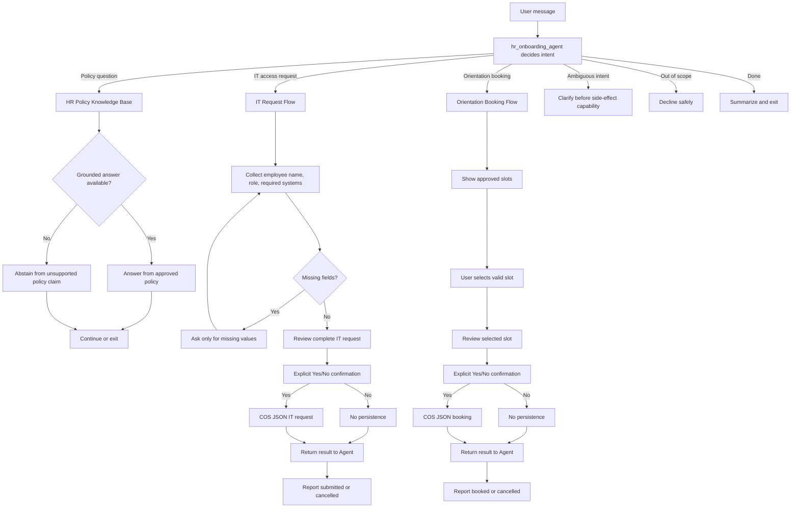

# Agent Decision Flow

This document is the Milestone 1 Agent decision-flow deliverable for Part A.

`hr_onboarding_agent` is the top-level ReAct Core Agent. It decides which capability should run
next and when. The IT and booking capabilities are bounded Flows that control how
side-effect-sensitive work completes after the Agent selects them.

Required behavior:

- Policy Q&A uses the native HR Policy Knowledge Base for approved policy content.
- Unsupported policy questions abstain rather than inventing facts.
- IT requests collect employee name, role, and required systems.
- Missing information triggers follow-up.
- IT and booking both require explicit confirmation before persistence.
- No/cancel paths write nothing.
- Confirmed paths create the intended record.
- Completion/exit must not repeat a completed side effect unless the user starts a new request.
